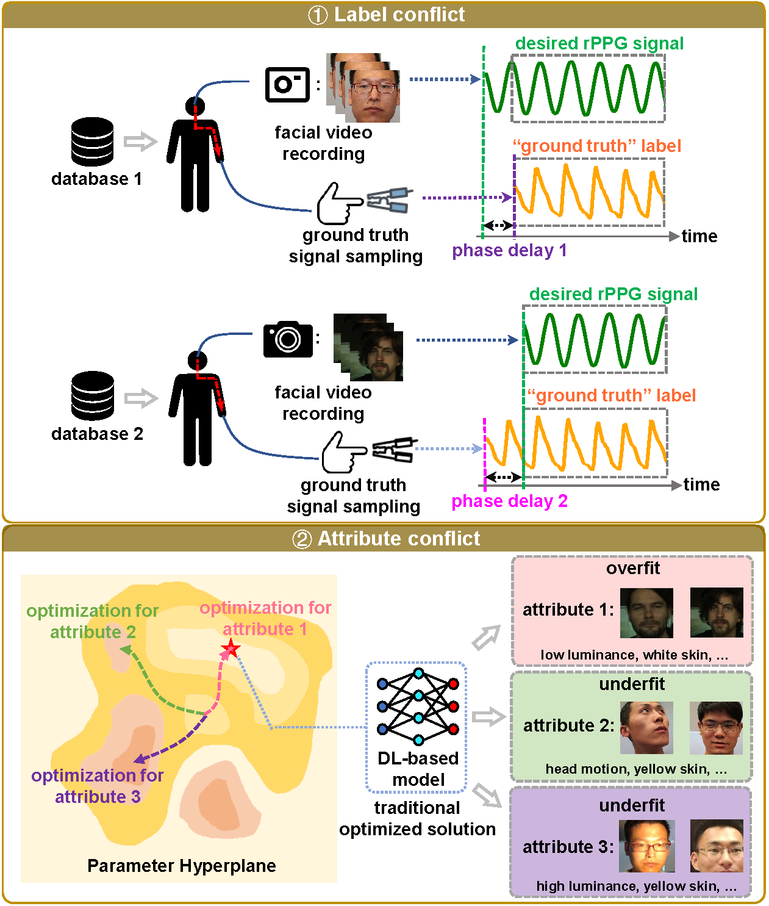
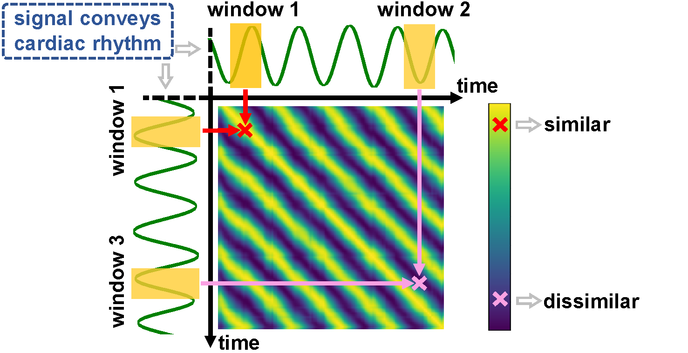
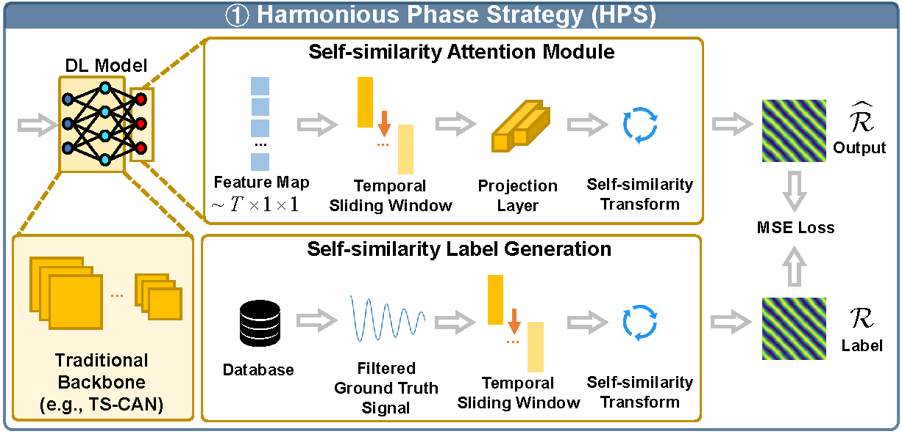

# DOHA-rPPG (DOmain-HArmonious framework)
This is the code corresponding to the paper ["Resolve Domain Conflicts for Generalizable Remote Physiological Measurement."](https://dl.acm.org/doi/10.1145/3581783.3612265) accepted in ACM MM 2023:fire: :fire: :fire:.

## What is rPPG? :crossed_fingers: :crossed_fingers: :crossed_fingers:
Generally speaking, remote photoplethysmography (rPPG) is a special  kind of physiological measurement which measures the physiological information (such as heart rate) of the subject through his/her facial video. The overall workflow of a typical rPPG is shown as follows:

The key element of rPPG is to extract the so-called **rPPG signal** from the facial video. The rPPG signal is regarded to presented the similar physiological features with **Blood Volume Pulse (BVP) signal**, from which we can extract various physiological information, such as heart rate.

## Current domain conflict Issues of DNN rPPG model training. :love_you_gesture: :love_you_gesture: :love_you_gesture:
Related databases for rPPG model training have the following flaws. (1) **Label Conflict**: The ground truth rPPG signals (e.g., BVP signal) in the database are not uniformed in time, i.e., there exist a unknown temporal delay between label and truth rPPG signal. (2) **Attribute Conflict**: The individual variability of data (e.g., skin color, ambient light) renders the rPPG model inefficient to train. We illustrate above two issues as follows:

## Harmonious Phase Strategy. :call_me_hand: :call_me_hand: :call_me_hand:

We focus on the self-similarity property of rPPG signal (which is periodical approximately), and thus generate a novel label representation, namely self-cosine-similarity (SCS) map, shown as follows:

By replacing the traditional ground truth label to our proposed SCS map for rPPG model training, we can elegantly get rid of label conflicts (as our new label representation doesn’t involve the real-time temporal delay). A typical network training pipeline is shown as follows:

**Note**: When selecting the ground truth signal (e.g., BVP signal), we choose the **identical timestamps** that "match" the input video. For example, if we select the video slice (from 10s to 20s) in the video, we pick the ground truth signal (from 10s to 20s) too. **Noteworthy**, even though we match the timestamps of the input video and the ground truth signal, we still can't ensure that these two are aligned due to the uncertain temporal delay. **Nevertheless**, our method can neutralize such a temporal delay, making the training more accessible and efficient.

## Still under construction!
Thanks for your reading! If this project can help you, we hope you could cite our works!

> @inproceedings{10.1145/3581783.3612265,author = {Sun, Weiyu and Zhang, Xinyu and Lu, Hao and Chen, Ying and Ge, Yun and Huang, Xiaolin and Yuan, Jie and Chen, Yingcong},
title = {Resolve Domain Conflicts for Generalizable Remote Physiological Measurement},
year = {2023},
isbn = {9798400701085},
publisher = {Association for Computing Machinery},
address = {New York, NY, USA},
url = {https://doi.org/10.1145/3581783.3612265},
doi = {10.1145/3581783.3612265},
booktitle = {Proceedings of the 31st ACM International Conference on Multimedia},
pages = {8214–8224},
numpages = {11},
keywords = {physiological signal estimation, multimedia application, rppg},
location = {Ottawa ON, Canada},
series = {MM '23}
}